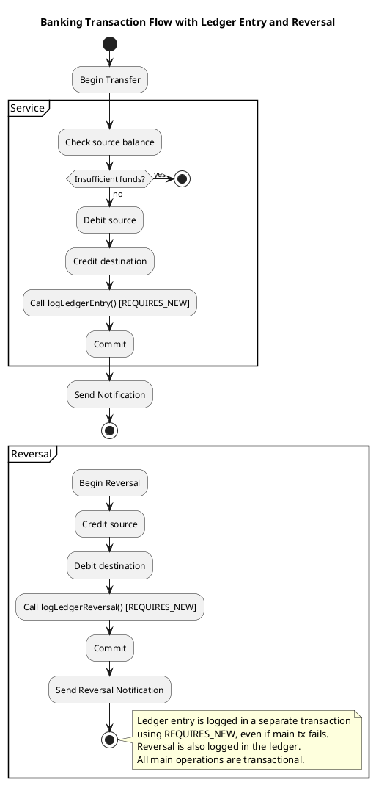

```plantuml
@startuml
title Banking Transaction Flow with Ledger Entry and Reversal

start
:Begin Transfer;
partition Service {
  :Check source balance;
  if (Insufficient funds?) then (yes)
    stop
  else (no)
    :Debit source;
    :Credit destination;
    :Call logLedgerEntry() [REQUIRES_NEW];
    :Commit;
  endif
}
:Send Notification;
stop

partition Reversal {
  :Begin Reversal;
  :Credit source;
  :Debit destination;
  :Call logLedgerReversal() [REQUIRES_NEW];
  :Commit;
  :Send Reversal Notification;
  stop
}

note right
Ledger entry is logged in a separate transaction
using REQUIRES_NEW, even if main tx fails.
Reversal is also logged in the ledger.
All main operations are transactional.
end note

@enduml

```