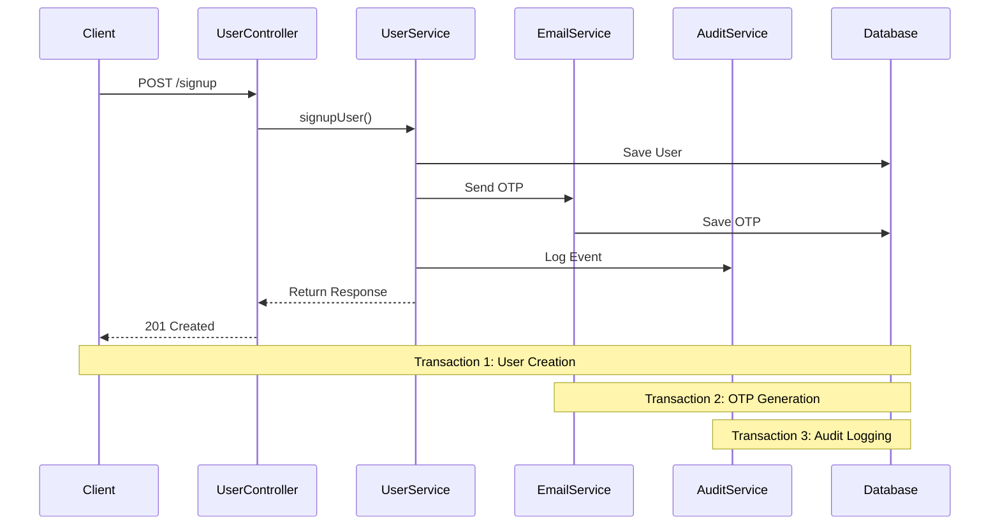
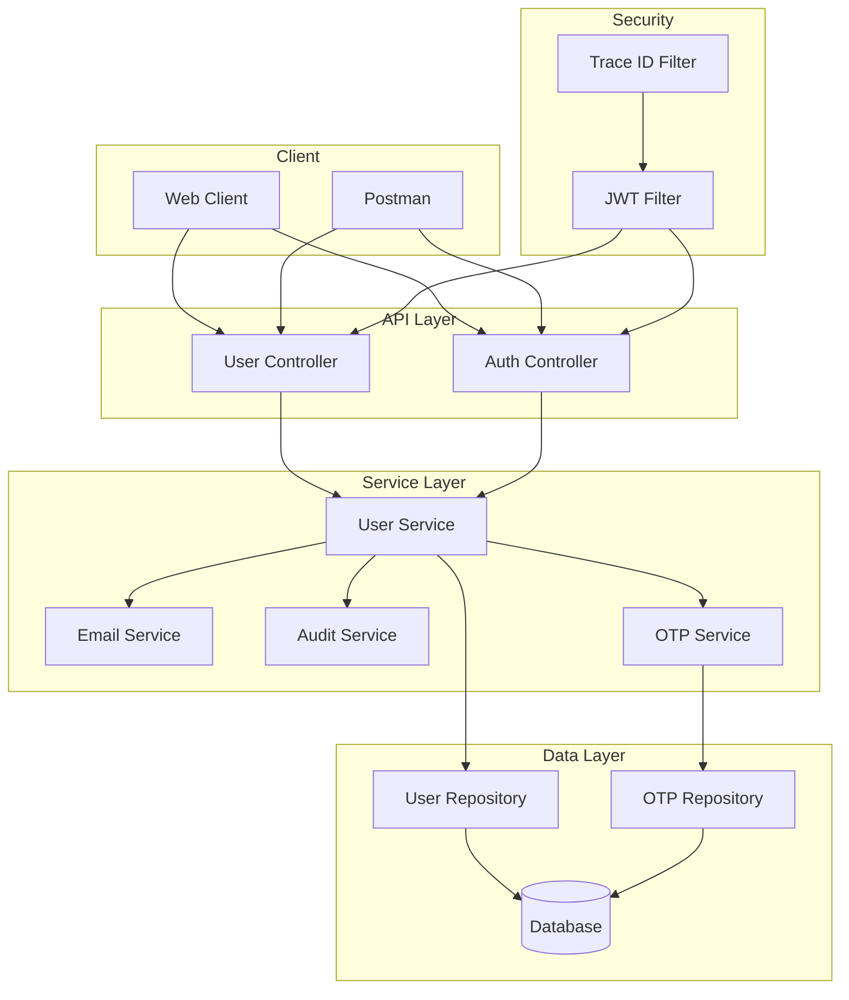

# User Signup Service with Transaction Management

## 🎯 Purpose
This project is designed as a learning exercise to understand key concepts of transaction management in Spring Boot applications. It implements a user signup flow with email verification, demonstrating various transaction scenarios and best practices. The project serves as a foundation that can be extended to build a full-fledged application with additional features.

## 📚 Learning Concepts
- **Transaction Management**
  - ACID Properties
  - Transaction Propagation
  - Isolation Levels
  - Rollback Scenarios
  - Distributed Transactions

- **Security**
  - JWT Authentication
  - Password Encryption
  - Role-based Authorization
  - Secure Session Management

- **Best Practices**
  - Request Tracing
  - Structured Logging
  - Exception Handling
  - API Documentation
  - Code Organization

## 🛠 Tech Stack
- **Backend Framework**: Spring Boot 3.x
- **Database**: H2 (Development), PostgreSQL (Production)
- **Security**: Spring Security with JWT
- **Email Service**: JavaMailSender
- **Logging**: SLF4J with Logback
- **Build Tool**: Maven
- **Testing**: JUnit 5, Mockito
- **Documentation**: Swagger/OpenAPI

## 🔄 Transaction Flow


## 🏗 Architecture


## 📡 API Endpoints

### Authentication
- `POST /api/auth/login`
  - Request: `{ "email": "string", "password": "string" }`
  - Response: `{ "token": "string" }`

### User Management
- `POST /api/users/signup`
  - Request: `{ "name": "string", "email": "string", "password": "string" }`
  - Response: `{ "id": "long", "name": "string", "email": "string", "status": "string", "emailVerified": "boolean" }`

- `POST /api/users/verify-otp`
  - Request: `{ "email": "string", "otp": "string" }`
  - Response: `{ "id": "long", "name": "string", "email": "string", "status": "string", "emailVerified": "boolean" }`

- `GET /api/users/profile`
  - Headers: `Authorization: Bearer <token>`
  - Response: `{ "id": "long", "name": "string", "email": "string", "status": "string", "emailVerified": "boolean" }`

## 🚀 Running Locally

### Prerequisites
- Java 17 or higher
- Maven
- IDE (IntelliJ IDEA recommended)

### Setup Steps
1. Clone the repository
```bash
git clone https://github.com/yourusername/user-signup-service.git
cd user-signup-service
```

2. Configure application properties
```properties
# src/main/resources/application.properties
spring.datasource.url=jdbc:h2:mem:testdb
spring.datasource.driverClassName=org.h2.Driver
spring.datasource.username=sa
spring.datasource.password=
spring.jpa.database-platform=org.hibernate.dialect.H2Dialect
spring.h2.console.enabled=true

# JWT Configuration
app.jwt.secret=your-secret-key
app.jwt.expiration=86400000

# Email Configuration
spring.mail.host=smtp.gmail.com
spring.mail.port=587
spring.mail.username=your-email@gmail.com
spring.mail.password=your-app-password
```

3. Build the project
```bash
mvn clean install
```

4. Run the application
```bash
mvn spring-boot:run
```

5. Access the application
- API: http://localhost:8080
- H2 Console: http://localhost:8080/h2-console

## 📦 Postman Collection
Import the following collection to test the APIs:
```json
{
  "info": {
    "name": "User Signup Service",
    "schema": "https://schema.getpostman.com/json/collection/v2.1.0/collection.json"
  },
  "item": [
    {
      "name": "Signup",
      "request": {
        "method": "POST",
        "url": "http://localhost:8080/api/users/signup",
        "body": {
          "mode": "raw",
          "raw": "{\"name\":\"John Doe\",\"email\":\"john@example.com\",\"password\":\"password123\"}",
          "options": {
            "raw": {
              "language": "json"
            }
          }
        }
      }
    },
    {
      "name": "Verify OTP",
      "request": {
        "method": "POST",
        "url": "http://localhost:8080/api/users/verify-otp",
        "body": {
          "mode": "raw",
          "raw": "{\"email\":\"john@example.com\",\"otp\":\"123456\"}",
          "options": {
            "raw": {
              "language": "json"
            }
          }
        }
      }
    },
    {
      "name": "Login",
      "request": {
        "method": "POST",
        "url": "http://localhost:8080/api/auth/login",
        "body": {
          "mode": "raw",
          "raw": "{\"email\":\"john@example.com\",\"password\":\"password123\"}",
          "options": {
            "raw": {
              "language": "json"
            }
          }
        }
      }
    },
    {
      "name": "Get Profile",
      "request": {
        "method": "GET",
        "url": "http://localhost:8080/api/users/profile",
        "header": [
          {
            "key": "Authorization",
            "value": "Bearer {{token}}"
          }
        ]
      }
    }
  ]
}
```

## 🔍 Testing Scenarios
1. **Basic Flow**
   - Signup → Receive OTP → Verify OTP → Login → Access Profile

2. **Transaction Scenarios**
   - User creation with email verification
   - OTP generation and verification
   - Audit logging
   - Failed transaction handling

3. **Security Scenarios**
   - Invalid credentials
   - Expired tokens
   - Missing authentication
   - Invalid OTP

## 📝 Logging and Monitoring
- Request tracing with traceId
- Structured logging in JSON format
- Performance metrics
- Error tracking

## 🔜 Future Enhancements
- [ ] Add role-based access control
- [ ] Implement refresh tokens
- [ ] Add rate limiting
- [ ] Implement caching
- [ ] Add API documentation with Swagger
- [ ] Add unit and integration tests
- [ ] Implement password reset flow
- [ ] Add social login integration

## 🤝 Contributing
Contributions are welcome! Please feel free to submit a Pull Request.

## 📄 License
This project is licensed under the MIT License - see the [LICENSE](LICENSE) file for details. 